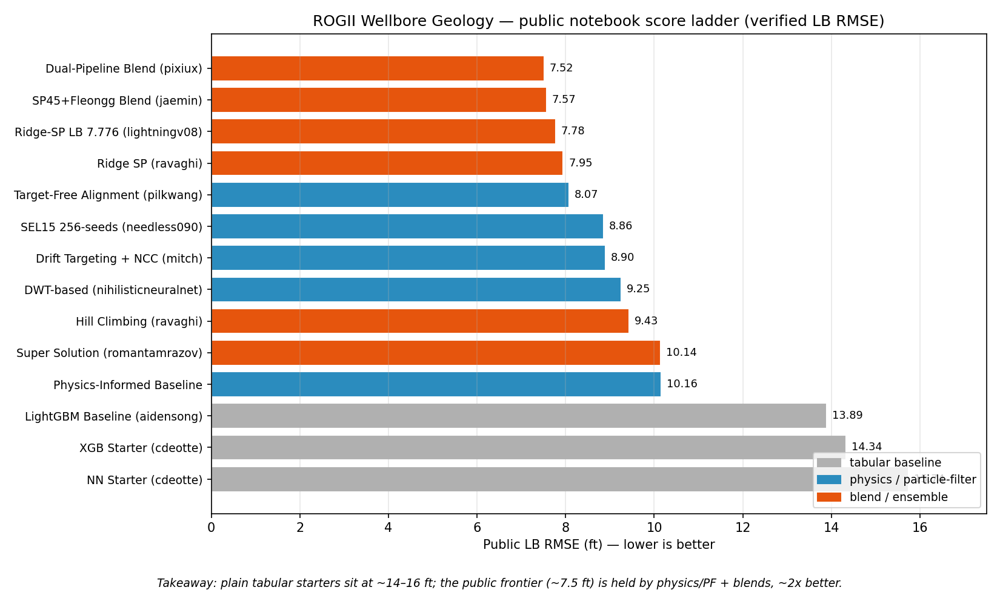
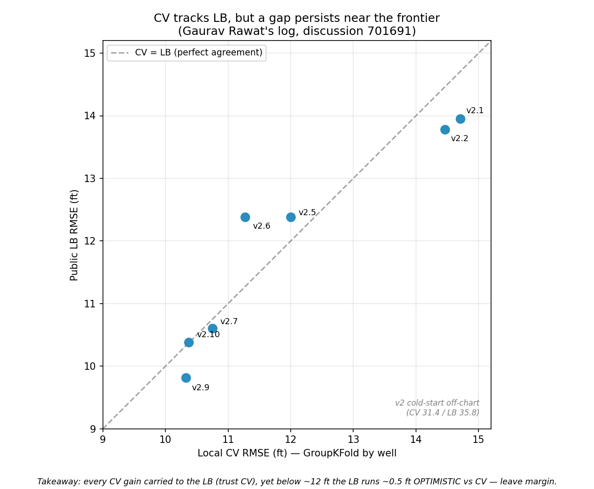

# ROGII — Wellbore Geology Prediction: Strategy Brief

*Research compiled 2026-06-13 using the nvidia-kaggle skill (competition overview,
dataset, 90 discussions / 526 comments, 100 kernels). Every leaderboard number
below was fetched per-notebook from Kaggle and is a **verified public LB RMSE**
unless explicitly flagged as a title-claim.*

[Competition page](https://www.kaggle.com/competitions/rogii-wellbore-geology-prediction)

---

## 1. What the competition actually is

You predict **TVT** ("True Vertical Thickness" — really a *relative geological
depth index*: how far, vertically, the drill bit sits from a structure-following
reference surface) for the **hidden evaluation interval** of each horizontal well.

| Mechanic | Detail |
|---|---|
| **Metric** | **RMSE** on `tvt`, in feet (lower is better). |
| **Prediction unit** | One row per 1 ft of lateral well; `id = {WELLNAME}_{row_index}`. |
| **Data** | Per well: `{WELL}__horizontal_well.csv` (trajectory MD/X/Y/Z, `GR` gamma-ray, `TVT_input`) + `{WELL}__typewell.csv` (vertical reference: `TVT`, `GR`, `Geology` label) + a `.png` cross-section. ~773 train wells, ~200 test. 1.33 GB. |
| **The key column** | `TVT_input` is a copy of the target that is **present up to the prediction start, then NaN** through the evaluation zone. The last known value is a strong anchor. |
| **Train-only columns** | Formation-contact depths `ANCC, ASTNU, ASTNL, EGFDU, EGFDL, BUDA` and full `TVT` exist only in train — you cannot use them as test features. |
| **Submission** | Code competition (Notebooks). CPU/GPU ≤ 9 h, **internet off**, external data/pretrained models allowed, file `submission.csv`. |
| **Timeline** | Start May 5, 2026 · **Entry/merger July 29** · **Final Aug 5, 2026**. |
| **Prizes** | $25k / $13k / $7k / $5k (top 4). |

**Two things that shape every decision:**

1. **It's a geosteering / log-correlation problem, not plain tabular regression.**
   The signal is the *gamma-ray sequence* of the lateral matched against the
   vertical typewell. Feeding `[X,Y,Z,MD,GR]` straight into a GBM hits a hard
   ceiling — see §3.
2. **The public test set is tiny (~52 wells public / ~200 hidden) and the train
   set is large (773 wells).** Trust your local CV over LB probing; the
   community consensus is explicit on this ([discussion 704273](https://www.kaggle.com/competitions/rogii-wellbore-geology-prediction/discussion/704273)).
   Note also a [private-test rescore](https://www.kaggle.com/competitions/rogii-wellbore-geology-prediction/discussion/707695) (one outlier well excluded) — expect minor LB churn.

---

## 2. The score landscape (verified public LB)

The ladder is unusually legible here because method family predicts the score:

| Rung | Public LB RMSE (ft) | Representative notebook |
|---|---|---|
| **Plain tabular starter** | **~14–16** | [NN Starter – CV 15.5](https://www.kaggle.com/code/cdeotte/nn-starter-cv-15-5) `15.75` · [XGB Starter – CV 15](https://www.kaggle.com/code/cdeotte/xgb-starter-cv-15) `14.34` (Chris Deotte) |
| **Physics-informed baseline** | **~10** | [Physics-Informed Baseline](https://www.kaggle.com/code/karnakbaevarthur/physics-informed-baseline) `10.16` |
| **Single strong model / sequence method** | **~8.5–9.5** | [DWT-based](https://www.kaggle.com/code/nihilisticneuralnet/9-251-rogii-wellbore-geology-prediction-dwt-based) `9.25` · [Drift Targeting + NCC](https://www.kaggle.com/code/mitchgansemer/drift-targeting-ncc-tree-based-rogii-wellbore) `8.91` · [SEL15 256-seeds](https://www.kaggle.com/code/needless090/lb-8-860-rogii-sel15-256seeds) `8.86` |
| **Public frontier (blends)** | **~7.5–8.1** | [Dual-Pipeline Blend](https://www.kaggle.com/code/pixiux/rogii-dual-pipeline-blend) `7.52` · [SP45+Fleongg Blend](https://www.kaggle.com/code/jaemin3404/rogii-sp45-fleongg-blend-v2) `7.57` · [Ridge-SP LB 7.776](https://www.kaggle.com/code/lightningv08/lb-7-776-rogii-ridge-sp) `7.78` · [Target-Free Alignment](https://www.kaggle.com/code/pilkwang/rogii-eda-target-free-alignment-for-tvt) `8.07` |

> Two notebook titles claim ranks rather than scores — Roman Tamrazov's
> "[SUPER SOLUTION \| LB: TOP 3](https://www.kaggle.com/code/romantamrazov/rogii-super-solution-lb-top-3)" in fact scores a **verified `10.14`**, and the
> companion "[BETTER SOLUTION \| LB: 9.956](https://www.kaggle.com/code/romantamrazov/rogii-better-solution-lb-9-956)" — treat title numbers as marketing, not measurement.

**Where the bar is:** a competent tabular model lands ~14. The first ~5 ft of
improvement comes from *physics/sequence* features (down to ~9). The last ~1.5 ft
to the public frontier comes from *blending decorrelated pipelines* (~7.5).
Top participants expect the **private** frontier to fall much lower as the field
matures — Tucker Arrants guesses "maybe around 5 ft" ([discussion 699207](https://www.kaggle.com/competitions/rogii-wellbore-geology-prediction/discussion/699207)).

---

## 3. Winning techniques, each tied to its source

**(a) Anchor on the last known `TVT_input`, predict the residual.**
The strongest cheap baseline isn't predicting TVT directly — it's predicting the
*continuation* from the last observed `TVT_input` value. Chris Deotte's
[XGB Starter](https://www.kaggle.com/code/cdeotte/xgb-starter-cv-15) trains an
XGBoost **residual model over the last-known-`TVT_input` baseline**, with
GroupKFold-by-well and typewell GR-correlation features (CV ~15, LB 14.34).

**(b) Treat it as sequential geosteering, not row-wise regression.**
The community's central insight ([Paradigm Shift, discussion 699289](https://www.kaggle.com/competitions/rogii-wellbore-geology-prediction/discussion/699289)):
model the bit as a *moving particle* whose TVT state updates against GR
observations. The two workhorses:
- **Particle filters / beam search** over GR alignment — sequential Monte-Carlo
  tracking of TVT against the typewell log, with beam search catching branches a
  greedy tracker loses. Core of the frontier [Dual-Pipeline Blend](https://www.kaggle.com/code/pixiux/rogii-dual-pipeline-blend) (128 seeds × 4 scales).
- **Dynamic time warping (DTW)** — "stretch and fold" the lateral MD–GR strip to
  match the typewell TVT–GR reference. Introduced by hengck23 in
  [besides regression, also dwt](https://www.kaggle.com/competitions/rogii-wellbore-geology-prediction/discussion/697431); productized in the [DWT-based notebook](https://www.kaggle.com/code/nihilisticneuralnet/9-251-rogii-wellbore-geology-prediction-dwt-based) (9.25).

**(c) Exploit spatial neighbours (offset wells).** Geology is continuous: wells
in the same site share structure. Use `cKDTree` to find nearest known wells and
feed the **local TVT/formation-depth consensus** as a feature; it stabilizes
wells with weak/ambiguous GR ([discussion 699289](https://www.kaggle.com/competitions/rogii-wellbore-geology-prediction/discussion/699289); spatial priors are a named component in the [Dual-Pipeline Blend](https://www.kaggle.com/code/pixiux/rogii-dual-pipeline-blend)).

**(d) Trajectory-level robust de-noising.** A robust degree-4 IRLS polyfit of
`tvt + Z` vs `MD` kills jitter and wrong-branch outliers — the
[Dual-Pipeline Blend](https://www.kaggle.com/code/pixiux/rogii-dual-pipeline-blend)
reports this as CV-validated **−0.09 ft vs plain Savitzky-Golay smoothing**.

**(e) Blend decorrelated pipelines — the single biggest cheap win.** The frontier
notebooks are not one clever model; they're **two independent geosteering
pipelines averaged** (e.g. 0.55/0.45). Errors decorrelate → free accuracy. This
is what separates ~8.5 single models from the ~7.5 frontier.

**(f) Guard any "exact" leak.** Some test wells also appear in `train/` and their
TVT is reconstructable near-exactly (~0.01 ft) from formation-contact columns.
The [Dual-Pipeline Blend](https://www.kaggle.com/code/pixiux/rogii-dual-pipeline-blend)
warns this is **dangerous applied blindly** — at rerun the hidden copies may not
be row-aligned. Their fix: a *self-verifying override* that fires per-well only
if it reproduces that well's known prefix to < 1 ft (matched by MD, not row
index). Treat exact-lookup tricks as guarded, never blind.

**Promising frontier (not yet dominant):** deep CNN multi-trajectory inversion
with a mixture-density head for multi-path hypotheses, modelled on geophysical
log-inversion literature ([MTP with deep CNN, discussion 699853](https://www.kaggle.com/competitions/rogii-wellbore-geology-prediction/discussion/699853); example [CNN-MTP notebook](https://www.kaggle.com/code/hengck23/cnn-mtp-example)). hengck23's own caveat: the data is *very noisy*, so formulation isn't the bottleneck — matching is.

---

## 4. Validation: trust CV, but leave margin

- **Use GroupKFold by well.** Rows within a well are highly correlated; anything
  else leaks. Tucker Arrants reports plain GBDT at **CV ~11 → LB ~9.6**: a large
  but *stable* gap where every CV gain carried to LB ([discussion 701691](https://www.kaggle.com/competitions/rogii-wellbore-geology-prediction/discussion/701691)).
- **The CV→LB plot** (Gaurav Rawat's posted log, same thread) shows the relationship
  is monotone — but near the frontier (< ~12 ft) **LB runs ~0.5 ft optimistic vs
  CV**. Don't chase a 0.2-ft LB blip; it's inside the noise of a ~52-well public set.
- **Beware public-notebook leakage.** Some public notebooks show suspiciously
  small CV–LB gaps from leakage and are *not* trustworthy (Tucker Arrants, same thread).
- The direction of the CV–LB gap **depends on method**: spatial/offset methods
  tend CV < LB (public pessimistic); particle-filter methods tend CV > LB (public
  optimistic) ([discussion 704273](https://www.kaggle.com/competitions/rogii-wellbore-geology-prediction/discussion/704273)). Validate each component on its own.

---

## 5. An actionable path

1. **Orient (½ day).** Read [Chris Deotte's EDA Starter](https://www.kaggle.com/code/cdeotte/eda-starter) and the
   [problem diagram](https://www.kaggle.com/competitions/rogii-wellbore-geology-prediction/discussion/697418) (127 votes) +
   [How Geologists Interpret Wells](https://www.kaggle.com/competitions/rogii-wellbore-geology-prediction/discussion/698825). Understand MD vs TVD vs TVT and the
   typewell-as-ground-truth correlation before writing code.
2. **Baseline (1 day).** Reproduce the [XGB Starter](https://www.kaggle.com/code/cdeotte/xgb-starter-cv-15):
   residual-over-last-`TVT_input`, GroupKFold by well. Target ~14. This is your
   honest CV harness — keep it.
3. **Add physics & sequence features (most of the gain).** Build a particle-filter
   or DTW GR-alignment estimator ([697431](https://www.kaggle.com/competitions/rogii-wellbore-geology-prediction/discussion/697431),
   [DWT notebook](https://www.kaggle.com/code/nihilisticneuralnet/9-251-rogii-wellbore-geology-prediction-dwt-based)); add cKDTree offset-well consensus features
   ([699289](https://www.kaggle.com/competitions/rogii-wellbore-geology-prediction/discussion/699289)). Feed these into the GBM. Aim ~9.
4. **De-noise the trajectory.** Robust IRLS polyfit / SG smoothing on the output
   path ([Dual-Pipeline Blend](https://www.kaggle.com/code/pixiux/rogii-dual-pipeline-blend)).
5. **Blend decorrelated pipelines.** Build a *second* independent estimator
   (different tracker + spatial prior + GBM stack) and average. Study the
   [Dual-Pipeline Blend](https://www.kaggle.com/code/pixiux/rogii-dual-pipeline-blend) and
   [SP45+Fleongg Blend](https://www.kaggle.com/code/jaemin3404/rogii-sp45-fleongg-blend-v2). Aim ~7.5.
6. **Add a *guarded* exact-contact override** for overlap wells, validated on the
   known prefix per well ([Dual-Pipeline Blend](https://www.kaggle.com/code/pixiux/rogii-dual-pipeline-blend) §4). Never blind.
7. **(Stretch) CNN multi-trajectory inversion** as a decorrelated ensemble member
   ([699853](https://www.kaggle.com/competitions/rogii-wellbore-geology-prediction/discussion/699853)).

**Pitfalls to avoid:** treating it as pure tabular regression (hard ceiling ~14);
trusting the tiny public LB over CV; blind exact-lookup that breaks at rerun;
random (non-grouped) CV folds.

---

## Key sources

**Notebooks** — [Dual-Pipeline Blend (pixiux, LB 7.52)](https://www.kaggle.com/code/pixiux/rogii-dual-pipeline-blend) ·
[SP45+Fleongg Blend (jaemin, 7.57)](https://www.kaggle.com/code/jaemin3404/rogii-sp45-fleongg-blend-v2) ·
[Ridge-SP (lightningv08, 7.78)](https://www.kaggle.com/code/lightningv08/lb-7-776-rogii-ridge-sp) ·
[Target-Free Alignment (pilkwang, 8.07)](https://www.kaggle.com/code/pilkwang/rogii-eda-target-free-alignment-for-tvt) ·
[DWT-based (nihilisticneuralnet, 9.25)](https://www.kaggle.com/code/nihilisticneuralnet/9-251-rogii-wellbore-geology-prediction-dwt-based) ·
[XGB Starter (cdeotte, 14.34)](https://www.kaggle.com/code/cdeotte/xgb-starter-cv-15) ·
[NN Starter (cdeotte, 15.75)](https://www.kaggle.com/code/cdeotte/nn-starter-cv-15-5) ·
[EDA Starter (cdeotte)](https://www.kaggle.com/code/cdeotte/eda-starter) ·
[CNN-MTP example (hengck23)](https://www.kaggle.com/code/hengck23/cnn-mtp-example)

**Discussions** — [Diagram of the problem](https://www.kaggle.com/competitions/rogii-wellbore-geology-prediction/discussion/697418) ·
[Paradigm Shift: tabular wall](https://www.kaggle.com/competitions/rogii-wellbore-geology-prediction/discussion/699289) ·
[DWT / time warping](https://www.kaggle.com/competitions/rogii-wellbore-geology-prediction/discussion/697431) ·
[CNN MTP inversion](https://www.kaggle.com/competitions/rogii-wellbore-geology-prediction/discussion/699853) ·
[CV & LB correlations](https://www.kaggle.com/competitions/rogii-wellbore-geology-prediction/discussion/701691) ·
[How much to trust the LB](https://www.kaggle.com/competitions/rogii-wellbore-geology-prediction/discussion/704273) ·
[Below 10.0 single model?](https://www.kaggle.com/competitions/rogii-wellbore-geology-prediction/discussion/699207) ·
[Private test rescore](https://www.kaggle.com/competitions/rogii-wellbore-geology-prediction/discussion/707695)
