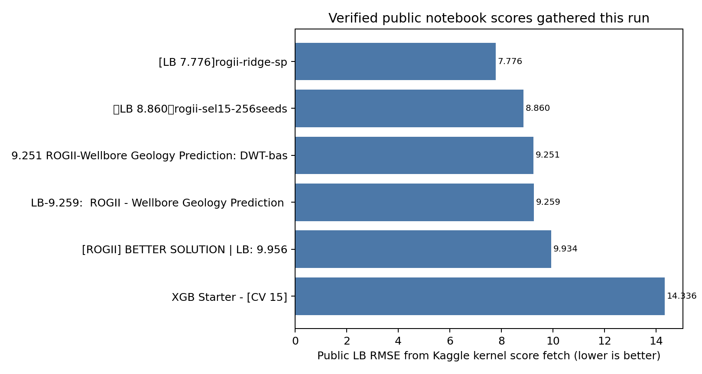
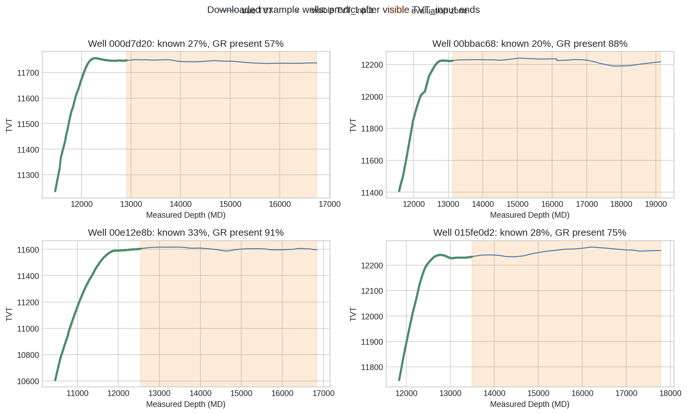
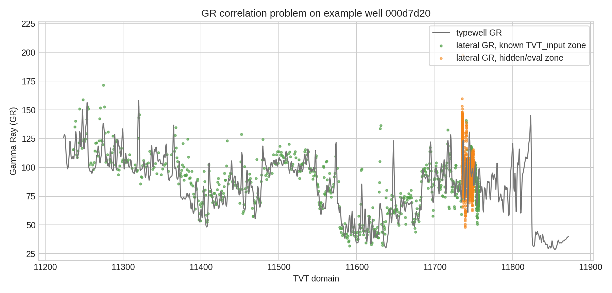
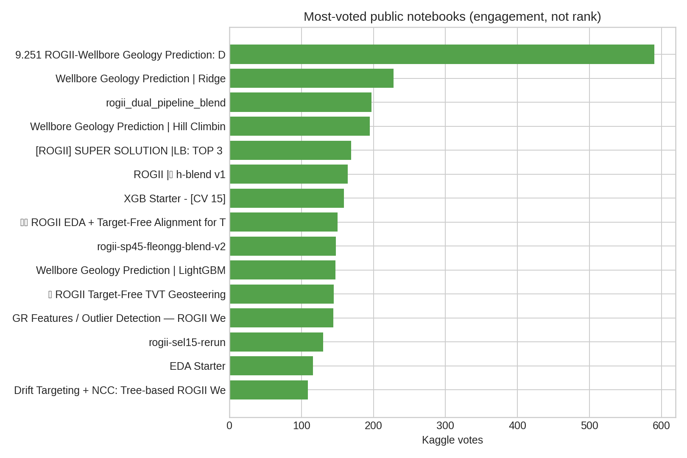

# ROGII Wellbore Geology Prediction — Strategy Brief

_Generated 2026-06-13 using the `nvidia-kaggle-skill`. Evidence gathered from the official Kaggle competition pages, public notebook metadata/code, selected discussion threads, verified public kernel-score fetches, and a small downloaded sample of example wells._

## Executive readout

This is not a generic tabular regression contest. The target is `tvt` (True Vertical Thickness) over the hidden/evaluation interval of each horizontal well, scored by RMSE, with submissions run as Kaggle Notebooks under a 9-hour CPU/GPU limit and no internet. The data structure makes the task closer to constrained geosteering / sequence alignment: each well gives a visible prefix of `TVT_input`, lateral well trajectory/logs, a typewell vertical GR curve, and hidden future TVT rows.

The public notebook ecosystem already shows a clear ladder:

| Level | Evidence | Public RMSE gathered this run | What it means |
|---|---:|---:|---|
| Starter ML | [XGB Starter - CV 15](https://www.kaggle.com/code/cdeotte/xgb-starter-cv-15) | 14.336 | A well-grouped residual model over last-known `TVT_input` is a useful baseline, but not competitive alone. |
| Strong public | [ROGII DWT-based](https://www.kaggle.com/code/nihilisticneuralnet/9-251-rogii-wellbore-geology-prediction-dwt-based) | 9.251 | Alignment, particle/beam features, formation priors, and model stacking beat plain tabular. |
| Stronger public | [LB 8.860 SEL15 256 seeds](https://www.kaggle.com/code/needless090/lb-8-860-rogii-sel15-256seeds) | 8.860 | Selector/seed ensembling is a meaningful improvement, but likely fragile without validation. |
| Best public found | [LB 7.776 rogii-ridge-sp](https://www.kaggle.com/code/lightningv08/lb-7-776-rogii-ridge-sp) | 7.776 | The current public recipe is hybrid: physics/geology priors + GR alignment + robust ensembling/selection. |

**What it takes to do well:** build a deterministic, per-well inference system that combines (1) `TVT_input` continuation, (2) GR correlation/alignment against the typewell and the lateral prefix, (3) formation-surface / spatial priors, (4) tree/linear models trained with grouped-by-well validation, and (5) conservative blending or per-well selection. The biggest risk is overfitting the public LB and stochastic submission drift.

## Competition mechanics that shape strategy

- **Prediction target:** one `tvt` prediction per hidden row in the evaluation zone, with IDs like `{WELLNAME}_{row_index}`.
- **Metric:** RMSE; because the target is in feet, outlier wells and long evaluation intervals can dominate.
- **Data:** each train well has `{well}__horizontal_well.csv`, `{well}__typewell.csv`, and a PNG; test wells have horizontal/typewell files. The visible test folder only contains sample instances; hidden rerun replaces it with roughly 200 wells.
- **Key columns:** `MD`, `X`, `Y`, `Z`, formation surfaces (`ANCC`, `ASTNU`, `ASTNL`, `EGFDU`, `EGFDL`, `BUDA`) in train, lateral `GR`, target `TVT`, and `TVT_input` where the evaluation interval is NaN.
- **Notebook constraints:** `submission.csv`, internet off, public external data and pretrained models allowed, 9-hour runtime.
- **Timeline:** started 2026-05-05; entry/merger deadline 2026-07-29; final submissions due 2026-08-05.

## Plots and takeaways

**Takeaway:** verified public notebook scores show the public gap: simple XGB is around 14.3 RMSE, while hybrid alignment/selection systems are already below 8 RMSE.

**Takeaway:** the visible `TVT_input` prefix can be only ~20–33% of the downloaded example well rows; most predictions are extrapolation/correlation into a long hidden interval.

**Takeaway:** the core signal is matching lateral GR behavior to the typewell GR curve in TVT space; there is useful signal, but missing/noisy GR and resolution differences make naive matching brittle.

**Takeaway:** votes identify important notebooks to study, but votes are not rank; several lower-vote notebooks have better verified public scores than the most-voted notebook.

## Key public notebooks to study

| Notebook | Why it matters | Evidence / score |
|---|---|---:|
| [XGB Starter - CV 15](https://www.kaggle.com/code/cdeotte/xgb-starter-cv-15) | Clean starter: uses only test-available fields, builds per-well context from known `TVT_input`, adds typewell GR-correlation features, and validates with `GroupKFold` by well to avoid row leakage. | Public score fetched: 14.336; notebook text reports local last-known baseline around 15.9 RMSE. |
| [ROGII EDA + Target-Free Alignment for TVT](https://www.kaggle.com/code/pilkwang/rogii-eda-target-free-alignment-for-tvt) | High-signal EDA around target-free alignment; useful for understanding the geometry, TVT continuity, and why direct rowwise regression is insufficient. | 150 votes; read for diagnostics and feature ideas, not score. |
| [ROGII Target-Free TVT Geosteering](https://www.kaggle.com/code/pilkwang/rogii-target-free-tvt-geosteering) | A geosteering framing rather than pure tabular ML; relevant for path/sequence thinking and lateral/typewell matching. | 145 votes. |
| [9.251 ROGII DWT-based](https://www.kaggle.com/code/nihilisticneuralnet/9-251-rogii-wellbore-geology-prediction-dwt-based) | Strong hybrid reference: code includes constrained DTW/DWT-style alignment, multi-scale NCC, beam search, particle-filter features, dense `ANCC` spatial imputation, CatBoost/Ridge-style modeling, and hill-climbing/blending pieces. | Public score fetched: 9.251; 590 votes. |
| [Wellbore Geology Prediction - Ridge](https://www.kaggle.com/code/ravaghi/wellbore-geology-prediction-ridge) | Practical model pipeline using LightGBM/CatBoost/Ridge, `GroupKFold`, spatial/formation features, and references to multiple high-performing public solutions. | 228 votes; useful as an implementation hub. |
| [Wellbore Geology Prediction - LightGBM](https://www.kaggle.com/code/ravaghi/wellbore-geology-prediction-lightgbm) | Companion tree model to the Ridge pipeline; useful for feature importances and ensemble diversity. | 147 votes. |
| [Wellbore Geology Prediction - Hill Climbing](https://www.kaggle.com/code/ravaghi/wellbore-geology-prediction-hill-climbing) | Public blending/hill-climbing approach; useful for learning how public notebooks combine predictions and why seed/control matters. | 195 votes. |
| [rogii_dual_pipeline_blend](https://www.kaggle.com/code/pixiux/rogii-dual-pipeline-blend) | High-engagement blend notebook; study for dual-pipeline architecture and practical submission assembly. | 197 votes. |
| [GR Features / Outlier Detection — ROGII Wellbore](https://www.kaggle.com/code/mitchgansemer/gr-features-outlier-detection-rogii-wellbore) | Focused on GR-derived features and outlier handling; important because GR is incomplete/noisy and hidden private scoring has outlier sensitivity. | 144 votes. |
| [Drift Targeting + NCC: Tree-based ROGII Wellbore](https://www.kaggle.com/code/mitchgansemer/drift-targeting-ncc-tree-based-rogii-wellbore) | Explicit normalized cross-correlation / drift-targeting framing; good bridge between geologic alignment and tree models. | 109 votes. |
| [ROGII Wellbore TVT — Physical Model](https://www.kaggle.com/code/sunnywu27/rogii-wellbore-tvt-physical-model) | Compact physical/particle-filter approach; illustrates a deterministic well-by-well alternative to heavy supervised modeling. | 108 votes; notebook claims visible training-well physical fit near 0.007 ft but hidden behavior is the real test. |
| [LB 7.776 rogii-ridge-sp](https://www.kaggle.com/code/lightningv08/lb-7-776-rogii-ridge-sp) | Best public score fetched in this run. Code includes particle-filter ensembles, beam search, multi-scale NCC, formation features, selector variants, Ridge/CatBoost components, and blending. | Public score fetched: 7.776. |
| [LB 8.860 rogii-sel15-256seeds](https://www.kaggle.com/code/needless090/lb-8-860-rogii-sel15-256seeds) | Strong public selector/seed-ensemble solution to inspect for robustness ideas. | Public score fetched: 8.860. |
| [LB-9.259 ROGII](https://www.kaggle.com/code/tasmim/lb-9-259-rogii-wellbore-geology-prediction) | Another score-confirmed public solution for comparison and blending diversity. | Public score fetched: 9.259. |
| [[ROGII] BETTER SOLUTION LB 9.956](https://www.kaggle.com/code/romantamrazov/rogii-better-solution-lb-9-956) | Earlier strong public baseline/lineage source; useful for historical progression. | Public score fetched: 9.934, title claims 9.956. |

## Key discussions and what they imply

| Discussion | Signal | Strategic implication |
|---|---|---|
| [Diagram of the problem](https://www.kaggle.com/competitions/rogii-wellbore-geology-prediction/discussion/697418) | Visual explanation of the target geometry. | Start by understanding TVT/MD/Z geometry; otherwise feature engineering is easy to misdirect. |
| [How Geologists Interpret Wells: Some Helpful Tips](https://www.kaggle.com/competitions/rogii-wellbore-geology-prediction/discussion/698825) | Organizer/geologist tip: lateral GR before prediction start can have better resolution than typewell GR; lateral GR can correlate with itself; nearby-well formation dip should be similar. | Use both lateral-prefix GR self-correlation and typewell correlation; build nearby-well/spatial dip features. |
| [besides regression, also dwt (time warping)!](https://www.kaggle.com/competitions/rogii-wellbore-geology-prediction/discussion/697431) | Frames the task as stretching/folding horizontal MD-GR to match typewell TVT-GR; notes train/test are close enough that regression can also work. | Treat regression and alignment as complementary, not substitutes. |
| [Paradigm Shift: Why pure Tabular Models might be hitting a wall](https://www.kaggle.com/competitions/rogii-wellbore-geology-prediction/discussion/699289) | Community warning that spatial/sequential context matters. | Move beyond rowwise features; include well-level, sequential, spatial, and correlation-derived features. |
| [stage.1: global search using linear prior tvt = linear(md,z)](https://www.kaggle.com/competitions/rogii-wellbore-geology-prediction/discussion/699326) | Suggests global search with simple physics/geometric prior. | Use low-dimensional priors as anchors for more complex search/modeling. |
| [Surface columns are in TVD (Z), NOT in TVT](https://www.kaggle.com/competitions/rogii-wellbore-geology-prediction/discussion/701034) | Important feature-semantics correction. | Do not naively treat formation surface columns as TVT; convert/relate via geometry. |
| [How much should we trust the LB score?](https://www.kaggle.com/competitions/rogii-wellbore-geology-prediction/discussion/704273) | Public LB trust/correlation concerns. | Build local well-grouped and holdout validation; avoid optimizing only public submissions. |
| [Is the public LB test set fixed?](https://www.kaggle.com/competitions/rogii-wellbore-geology-prediction/discussion/701995) | Repeated-score drift attributed to uncontrolled stochastic feature generation; Chris Deotte notes test data does not change. | Make every random process deterministic, including Numba/parallel/GPU paths, or scores may vary between identical submissions. |
| [Private Test Update and Rescore](https://www.kaggle.com/competitions/rogii-wellbore-geology-prediction/discussion/707695) | Organizers excluded an outlier well from private scoring; public LB unaffected. | Private set can contain edge cases; robust per-well handling and outlier detection remain important. |

## Winning system blueprint

### 1. Build a defensible validation scheme

- Use `GroupKFold` by well for baseline training so rows from one well never leak into validation.
- Add a second validation mode that masks the future interval of train wells to mimic test-time `TVT_input` NaNs.
- Track per-well RMSE, not just global RMSE; long/hard wells can dominate and hide regressions.
- Keep a “no-LB” model-selection table: local grouped CV, masked-future CV, and public LB. If public LB improves while both local views degrade, treat it as overfit.

### 2. Establish simple anchors

- Last-known `TVT_input` hold/flat baseline.
- Recent-slope continuation using `MD`, `Z`, and `TVT_input` prefix.
- Linear/geometric prior such as `tvt = f(MD, Z)` and formation-surface offsets.
- Per-well context: known TVT range, last TVT, slope over all/tail windows, GR availability, GR statistics, evaluation length.

These anchors are not enough to win, but they make the model stable and give every later method a fallback.

### 3. Add geologic alignment features

The strongest public methods repeatedly use variants of:

- Typewell GR interpolation in TVT space.
- Lateral-prefix GR self-correlation, especially because the organizer notes lateral GR can have better resolution than typewell GR.
- Multi-scale normalized cross-correlation (NCC) over short/medium/long windows.
- Constrained DTW/DWT-style path alignment from horizontal MD-GR to typewell TVT-GR.
- Beam search / particle filters that propagate TVT forward under smoothness and GR-likelihood constraints.

Turn these into both predictions and features: raw candidate TVT paths, path deltas from last-known TVT, agreement/disagreement between candidates, NCC confidence, DTW cost, and GR residuals after alignment.

### 4. Use formation and spatial priors carefully

- Formation surfaces (`ANCC`, `ASTNU`, `ASTNL`, `EGFDU`, `EGFDL`, `BUDA`) are powerful but easy to misuse: the community specifically flags that surface columns are in TVD/Z, not TVT.
- Fit offsets/relationships between `Z`, surfaces, and `TVT_input` in the visible prefix; extrapolate those offsets into the hidden zone.
- Use nearby train wells via `(X, Y)` and formation tops to estimate local dip or dense formation priors, as seen in strong public notebooks.
- Add “trust” features: how well each formation-derived path explains the visible prefix, not just the raw candidate path.

### 5. Model residuals, not absolute TVT alone

Recommended supervised targets:

- Residual from last-known flat baseline.
- Residual from slope continuation.
- Residual from best alignment/particle/beam candidate.
- Direct `TVT` only as one ensemble member.

Useful model family mix:

- Ridge/linear models for stable blending and low-variance residual correction.
- LightGBM/CatBoost/XGBoost for nonlinear interactions among alignment, spatial, and per-well features.
- Optional neural/sequence models only if validation proves they improve masked-future per-well RMSE; public discussions suggest pure tabular can hit a wall, but uncontrolled sequence complexity can also overfit.

### 6. Blend conservatively

- Blend independent candidates: geometric continuation, typewell alignment, lateral self-correlation, particle filter, beam search, tree residual model, Ridge residual model.
- Use per-well selectors only when the selector uses visible-prefix diagnostics available at test time: GR fit quality, known-prefix length, evaluation length, formation-prior fit, candidate disagreement, and missing-GR fraction.
- Hill-climbing on public predictions is useful for learning, but it should not be the final selection criterion without local validation support.

### 7. Make the notebook deterministic and runtime-safe

- Fix seeds in Python, NumPy, model libraries, and inside Numba-jitted functions if used.
- Avoid nondeterministic multiprocessing/GPU paths unless reproducibility is verified by repeated commits.
- Cache/compute features efficiently; hidden test has ~200 wells and the notebook limit is 9 hours.
- Include robust fallbacks for wells with sparse/missing GR, no good typewell correlation, unusually long hidden intervals, or outlier geometry.

## Practical milestone plan

1. **Day 1 baseline:** reproduce [XGB Starter - CV 15](https://www.kaggle.com/code/cdeotte/xgb-starter-cv-15), confirm local grouped CV, and add per-well masked-future validation.
2. **Day 2 alignment:** implement NCC/typewell GR features inspired by [Drift Targeting + NCC](https://www.kaggle.com/code/mitchgansemer/drift-targeting-ncc-tree-based-rogii-wellbore) and [DWT-based](https://www.kaggle.com/code/nihilisticneuralnet/9-251-rogii-wellbore-geology-prediction-dwt-based).
3. **Day 3 priors:** add formation/Z/spatial priors after confirming the TVD-vs-TVT semantics from the [surface-columns discussion](https://www.kaggle.com/competitions/rogii-wellbore-geology-prediction/discussion/701034).
4. **Day 4 models:** train Ridge + CatBoost/LightGBM/XGB residual models with group folds and masked-future folds.
5. **Day 5 inference stack:** add beam/particle-filter candidates from [Physical Model](https://www.kaggle.com/code/sunnywu27/rogii-wellbore-tvt-physical-model) and [LB 7.776 Ridge SP](https://www.kaggle.com/code/lightningv08/lb-7-776-rogii-ridge-sp), then blend by visible-prefix diagnostics.
6. **Day 6 robustness:** repeated deterministic commits, per-well error audit, GR-missing fallback, outlier handling, runtime profiling.
7. **Final week:** freeze a small set of diverse, reproducible submissions; do not keep chasing one-off public LB jumps.

## Watch-outs

- **Public score is not enough.** The public LB can reward brittle selectors; use local masked validation and per-well diagnostics.
- **Do not leak rows within wells.** Row-level random split is invalid because adjacent rows share the same well trajectory and target path.
- **Do not confuse `Z`/TVD and `TVT`.** Formation surface columns need geometric interpretation.
- **GR is incomplete and resolution differs.** Organizer tips explicitly favor lateral-prefix GR in some cases.
- **Reproducibility matters.** Identical notebooks can score differently when stochastic feature generation, Numba seeds, parallelism, or GPU nondeterminism are uncontrolled.
- **Private outliers exist.** A private-set outlier was excluded from scoring, but this is still a warning that edge-case handling matters.

## Source inventory

### Official pages

- [Competition overview](https://www.kaggle.com/competitions/rogii-wellbore-geology-prediction/overview)
- [Data page](https://www.kaggle.com/competitions/rogii-wellbore-geology-prediction/data)
- [Leaderboard](https://www.kaggle.com/competitions/rogii-wellbore-geology-prediction/leaderboard)

### Public notebooks highlighted

- [9.251 ROGII-Wellbore Geology Prediction: DWT-based](https://www.kaggle.com/code/nihilisticneuralnet/9-251-rogii-wellbore-geology-prediction-dwt-based)
- [Wellbore Geology Prediction - Ridge](https://www.kaggle.com/code/ravaghi/wellbore-geology-prediction-ridge)
- [rogii_dual_pipeline_blend](https://www.kaggle.com/code/pixiux/rogii-dual-pipeline-blend)
- [Wellbore Geology Prediction - Hill Climbing](https://www.kaggle.com/code/ravaghi/wellbore-geology-prediction-hill-climbing)
- [[ROGII] SUPER SOLUTION LB TOP 3](https://www.kaggle.com/code/romantamrazov/rogii-super-solution-lb-top-3)
- [ROGII h-blend v1](https://www.kaggle.com/code/nina2025/rogii-h-blend-v1)
- [XGB Starter - CV 15](https://www.kaggle.com/code/cdeotte/xgb-starter-cv-15)
- [ROGII EDA + Target-Free Alignment for TVT](https://www.kaggle.com/code/pilkwang/rogii-eda-target-free-alignment-for-tvt)
- [rogii-sp45-fleongg-blend-v2](https://www.kaggle.com/code/jaemin3404/rogii-sp45-fleongg-blend-v2)
- [Wellbore Geology Prediction - LightGBM](https://www.kaggle.com/code/ravaghi/wellbore-geology-prediction-lightgbm)
- [ROGII Target-Free TVT Geosteering](https://www.kaggle.com/code/pilkwang/rogii-target-free-tvt-geosteering)
- [GR Features / Outlier Detection — ROGII Wellbore](https://www.kaggle.com/code/mitchgansemer/gr-features-outlier-detection-rogii-wellbore)
- [Drift Targeting + NCC: Tree-based ROGII Wellbore](https://www.kaggle.com/code/mitchgansemer/drift-targeting-ncc-tree-based-rogii-wellbore)
- [ROGII Wellbore TVT — Physical Model](https://www.kaggle.com/code/sunnywu27/rogii-wellbore-tvt-physical-model)
- [LB 7.776 rogii-ridge-sp](https://www.kaggle.com/code/lightningv08/lb-7-776-rogii-ridge-sp)
- [LB 8.860 rogii-sel15-256seeds](https://www.kaggle.com/code/needless090/lb-8-860-rogii-sel15-256seeds)
- [LB-9.259 ROGII](https://www.kaggle.com/code/tasmim/lb-9-259-rogii-wellbore-geology-prediction)
- [[ROGII] BETTER SOLUTION LB 9.956](https://www.kaggle.com/code/romantamrazov/rogii-better-solution-lb-9-956)

### Discussions highlighted

- [Diagram of the problem](https://www.kaggle.com/competitions/rogii-wellbore-geology-prediction/discussion/697418)
- [How Geologists Interpret Wells: Some Helpful Tips](https://www.kaggle.com/competitions/rogii-wellbore-geology-prediction/discussion/698825)
- [Geological Formations on well Geology](https://www.kaggle.com/competitions/rogii-wellbore-geology-prediction/discussion/697406)
- [besides regression, also dwt (time warping)!](https://www.kaggle.com/competitions/rogii-wellbore-geology-prediction/discussion/697431)
- [Paradigm Shift: Why pure Tabular Models might be hitting a wall](https://www.kaggle.com/competitions/rogii-wellbore-geology-prediction/discussion/699289)
- [stage.1: global search using linear prior tvt = linear(md,z)](https://www.kaggle.com/competitions/rogii-wellbore-geology-prediction/discussion/699326)
- [Is online learning / test-time fine-tuning allowed?](https://www.kaggle.com/competitions/rogii-wellbore-geology-prediction/discussion/698002)
- [Surface columns are in TVD (Z), NOT in TVT](https://www.kaggle.com/competitions/rogii-wellbore-geology-prediction/discussion/701034)
- [How much should we trust the LB score?](https://www.kaggle.com/competitions/rogii-wellbore-geology-prediction/discussion/704273)
- [Is the public LB test set fixed?](https://www.kaggle.com/competitions/rogii-wellbore-geology-prediction/discussion/701995)
- [Private Test Update and Rescore](https://www.kaggle.com/competitions/rogii-wellbore-geology-prediction/discussion/707695)

## Generated artifacts

- `plots/verified_public_kernel_scores.png` — verified public scores for selected notebooks gathered with the skill score fetcher.
- `plots/example_well_tvt_input_windows.png` — TVT/known-input windows for four downloaded example wells.
- `plots/example_gr_correlation_problem.png` — lateral/typewell GR correlation illustration for example well `000d7d20`.
- `plots/top_public_notebooks_votes.png` — engagement chart for most-voted public notebooks.
- `work/verified_public_kernel_scores.csv` — source table for verified public score plot.
- `work/example_well_summary.csv` — source table for downloaded example-well plot.
